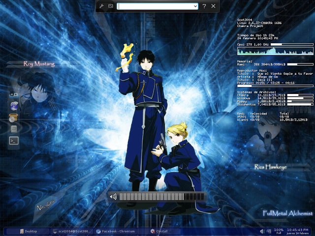
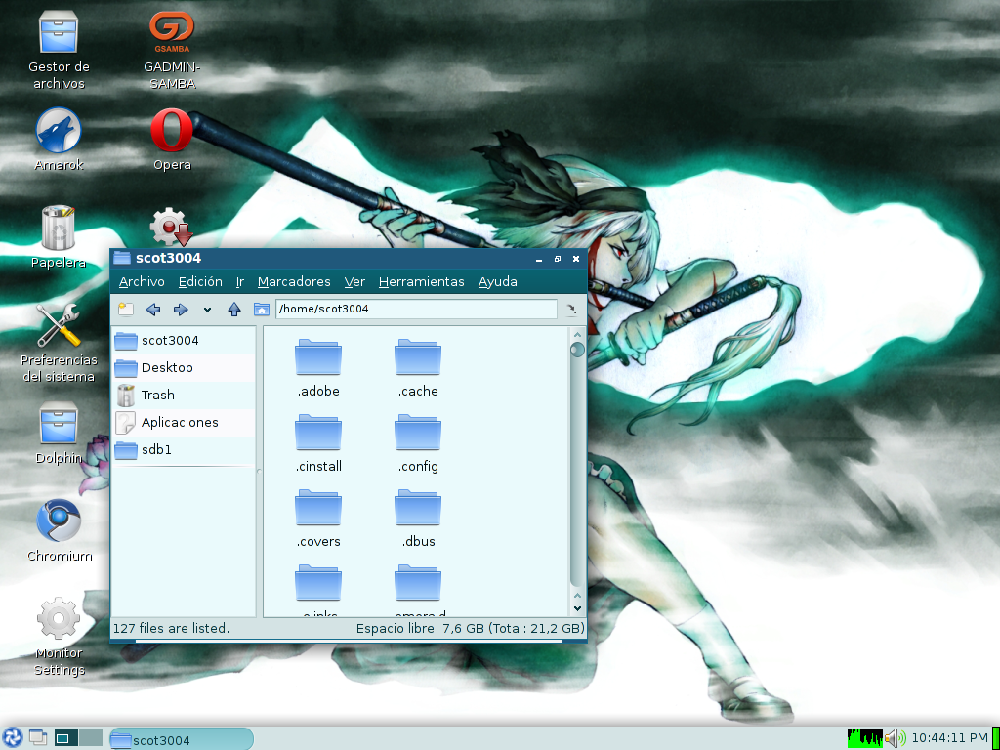
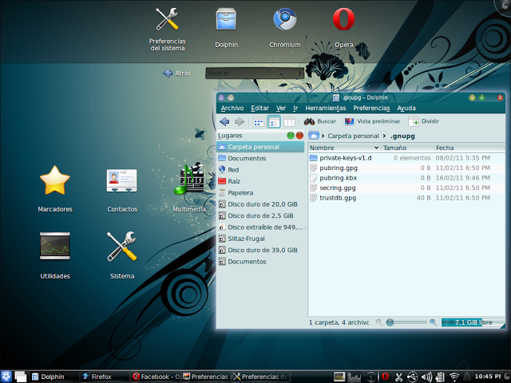

Screenshots de mi Linux
Un toque personal de lo que se puede hacer con GNU/Linux
un tiempo en hacer el escritorio mas agradable es un tiempo de aprendizaje
Openbox
LXDE
escritorios de por si hermosos a continuación las capturas de ellos

